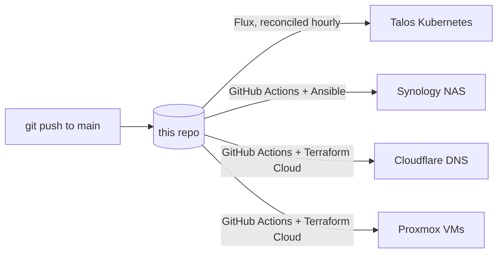

# homelab-infra

A self-hosted homelab managed entirely from Git. A Talos Kubernetes cluster is
reconciled by Flux, a Synology NAS is reconciled by Ansible, and public DNS and the
Proxmox VMs themselves are managed with Terraform. Pushing to `main` is the only
deploy step. The Kubernetes nodes run as VMs on my Proxmox server, provisioned by
Terraform.

## Architecture

Three control planes, one repo:

- **Kubernetes** runs on a 3-node Talos Linux cluster. Flux watches this repo and
  applies the desired state on an interval, with pruning, so the cluster always matches
  Git.
- **Docker** runs on a Synology NAS. A self-hosted GitHub Actions runner triggers
  Ansible whenever anything under `ansible/` changes, which renders and brings up the
  Compose stacks.
- **DNS** for the `khider.fr` zone, and the **Proxmox VMs** the Kubernetes cluster
  runs on, are declared in Terraform and applied through Terraform Cloud. A
  GitHub Actions workflow plans on pull requests and applies on push to `main`
  whenever anything under `terraform/` changes.



## How it works

### Kubernetes (Flux)

Flux is bootstrapped from `clusters/homelab-prod/flux-system`, which defines the Git
source. Three Flux Kustomizations, themselves version-controlled in
`clusters/homelab-prod/`, reconcile the rest of the repo every hour with
`prune: true`. Monitoring and apps declare `dependsOn: infrastructure-sync`, so
controllers and Helm sources are always in place before workloads reconcile:

| Kustomization         | Path              | Contents                                                                          |
| --------------------- | ----------------- | ---------------------------------------------------------------------------------- |
| `infrastructure-sync` | `./infrastructure`| Helm sources, Traefik, MetalLB, CoreDNS, cert-manager, Velero, device plugin, GitHub Actions runner |
| `monitoring-sync`     | `./monitoring`    | kube-prometheus-stack, ingress, alerting, scrape configs                          |
| `apps-sync`           | `./apps`          | All application workloads                                                         |

Applications are deployed as Flux `HelmRelease` resources pinned to versioned Helm
repositories, so every upgrade is an explicit, reviewable change in Git.

Traefik is the single reverse proxy for the whole homelab: MetalLB (Layer 2 mode)
gives it one stable LAN IP, the router forwards public traffic straight to it (locked
down to Cloudflare's IP ranges), and internal DNS points every `*.local.khider.fr`
host at the same IP. `apps/external-services/` extends this to backends that aren't
Kubernetes Services, reached via `ExternalName` Services and IngressRoutes: Proxmox,
Synology DSM, and UniFi are internal-only at their own `*.local.khider.fr` hostnames,
gated by an `ipAllowList` middleware restricting them to the LAN and VPN subnets,
while `torrent.khider.fr` (Synology's qBittorrent) is public, behind an Authentik
`forwardAuth` middleware.

DNS for `local.khider.fr` also runs in-cluster now: CoreDNS (`infrastructure/controllers/coredns/`)
replaced a BIND instance that used to run on a dedicated Ubuntu VM. It serves that zone
authoritatively via the `file` plugin and forwards everything else to 1.1.1.1/1.0.0.1,
since the router hands it out as the LAN's general DNS resolver, not just for
`local.khider.fr`. It reuses the same MetalLB-assigned IP the old BIND instance had, so
no client-side DNS settings needed to change. That Ubuntu VM has since been retired
entirely, it had no other workloads left once BIND moved.

### Docker (Ansible)

`.github/workflows/ansible-deploy.yaml` runs on a self-hosted runner and executes
`ansible/deploy-homelab.yml`. The playbook copies each stack's `docker-compose.yaml`
to the target host and runs `docker compose up`, idempotently, against the Synology
NAS defined in `ansible/inventory.ini`.

### DNS and Proxmox VMs (Terraform)

`terraform/cloudflare/` declares every record in the `khider.fr` Cloudflare zone: the
apex `A` record (pointed at the home IP, kept out of Git as a sensitive variable), the
per-service `CNAME`s (Authentik, Jellyfin, Sonarr, qBittorrent, Nextcloud, …), and the
mail records (MX, SPF, DKIM, DMARC). `terraform/proxmox/` declares the three Talos
Kubernetes node VMs via the Proxmox provider.
State and runs live in Terraform Cloud (organization `Tarek-Corp`, workspaces
`cloudflare-terraform` and `proxmox`). `.github/workflows/terraform.yml`
runs `terraform plan` on pull requests and `terraform apply` on push to `main`, so
changes are reviewed before they go live.

## What's running

### On Kubernetes

| Component              | Role                                                          |
| ---------------------- | ------------------------------------------------------------- |
| Traefik                | Ingress controller and reverse proxy for all public and internal traffic, including non-Kubernetes hosts (Proxmox, Synology, UniFi) via `apps/external-services/` |
| MetalLB                | Bare-metal LoadBalancer (Layer 2), gives Traefik and CoreDNS their stable LAN IPs |
| CoreDNS                | Authoritative DNS for `local.khider.fr` and general resolver for the LAN, replaced BIND |
| cert-manager           | Automated TLS, issued through the Cloudflare DNS-01 challenge |
| Authentik              | SSO and identity, enforced in front of services via Traefik   |
| Grafana                | Dashboards                                                     |
| Jellyfin               | Media server, GPU transcoding via the device plugin below     |
| Sonarr / Prowlarr      | Media automation                                              |
| generic-device-plugin  | Exposes `/dev/dri` to the cluster for hardware transcoding     |
| actions-runner-controller | Self-hosted GitHub Actions runner used by the Ansible workflow |
| Velero                 | Off-site backups of stateful workloads to Cloudflare R2       |
| Nextcloud               | File sync and storage, public at `cloud.khider.fr`            |
| n8n                     | Workflow automation, internal-only at `n8n.local.khider.fr`   |
| khider.fr              | Personal static website (nginx), public at `khider.fr`        |

### On Docker

| Host          | Stacks                                            |
| ------------- | -------------------------------------------------- |
| Synology NAS  | qBittorrent, blackbox-exporter, smartctl-exporter |

The Ubuntu VM that used to run on Proxmox is gone entirely. It hosted Nginx Proxy
Manager, a standalone Traefik instance, and BIND, all fully replaced by the in-cluster
Traefik Ingress and CoreDNS above, and retired once nothing else was left running on
it. MariaDB on the Synology has also been retired: it only held databases from systems
this homelab has since replaced (Authelia, a prior k3s cluster, and the last
Docker-hosted Nextcloud before its move to Kubernetes), none of which are still live.

## Secrets

Secrets are committed to Git as **Sealed Secrets**. The values are encrypted with the
cluster controller's public key and can only be decrypted in-cluster, so the repo is
safe to keep public. No plaintext credentials live in the tree or its history.

## Storage

Persistent volumes for the cluster are provisioned over iSCSI by the Synology CSI
driver (`synology-nas/syno-sc.yaml`).

## Backups

Velero backs up stateful workloads to a Cloudflare R2 bucket, so a copy of every
important volume lives off the NAS. Each backup takes a CSI snapshot on the Synology,
then the data mover streams the volume contents to R2 with Kopia, deduplicated and
incremental. Backup policy is declarative: every app that needs protection carries a
`backup-schedule.yaml` next to its manifests, reviewed and versioned like everything
else. Daily backups cover Authentik, n8n, Nextcloud, and the media configs; Grafana runs weekly;
retention is 14 days. Prometheus data and stateless workloads are deliberately
excluded, since Flux rebuilds the latter from this repo. R2 credentials are committed
as a Sealed Secret like every other secret in the tree.

## Updates

Renovate runs continuously and opens pull requests to bump Helm charts, container
images, and GitHub Actions across the repo, so dependency upgrades stay small and
reviewable.

## Layout

```
.
├── clusters/homelab-prod/   # Flux bootstrap + the three sync Kustomizations
│   └── flux-system/         # Git source (gotk)
├── infrastructure/          # cluster-wide infra, reconciled first
│   ├── sources/             # shared Helm repositories
│   └── controllers/         # Traefik, MetalLB, CoreDNS, cert-manager, Velero, device plugin, GitHub Actions runner
├── apps/                    # Helm-based application workloads
│   └── external-services/   # Traefik routes to non-Kubernetes hosts (Proxmox, Synology, UniFi)
├── monitoring/              # kube-prometheus-stack, ingress, alerting, scrape configs
├── synology-nas/            # cluster storage class (Synology CSI), applied manually
├── terraform/
│   ├── cloudflare/          # Cloudflare DNS records (Terraform Cloud)
│   └── proxmox/             # Proxmox VMs for the Kubernetes cluster
├── ansible/                 # Docker Compose stacks + playbook
│   ├── docker/              # per-host, per-stack compose files
│   ├── inventory.ini
│   └── deploy-homelab.yml
└── renovate.json
```

## Roadmap

- Application-consistent database backups: pg_dump hooks for Authentik's Postgres
  ahead of the volume snapshot.
- Periodic restore drills to prove backups round-trip.
